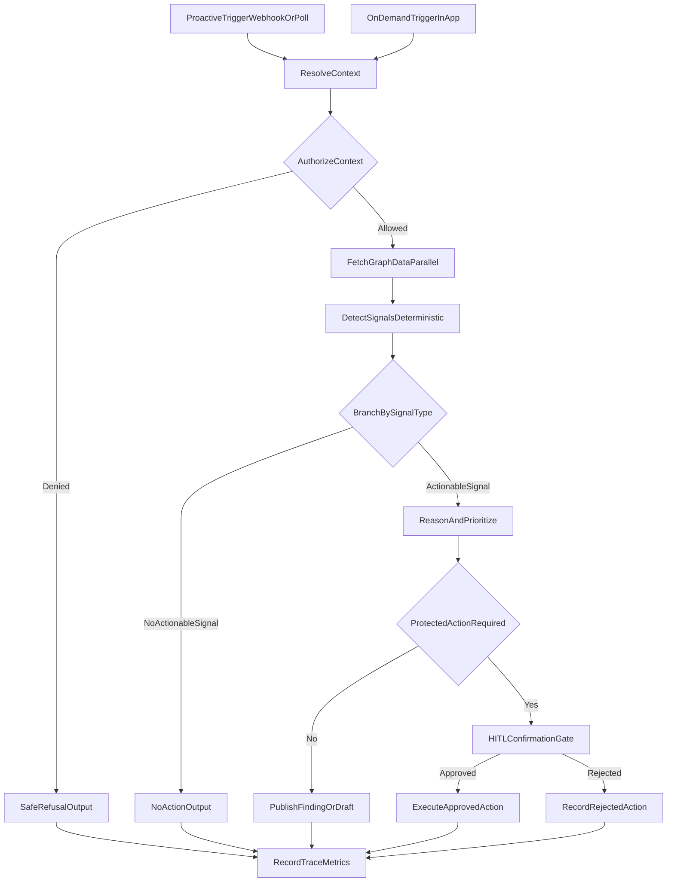

# FleetGraph

## Agent Responsibility

FleetGraph is a project intelligence agent for Ship. It monitors execution quality, evidence quality, delivery risk, and review readiness across issue, week, and project workflows. It is not a replacement for Ship; it is an intelligence overlay that surfaces what needs human attention next.

### What FleetGraph monitors proactively

- Stale or overdue blockers and delivery items.
- Missing or weak weekly plans, retros, and approval handoffs.
- Incomplete evidence for completed claims.
- Compliance/verification gaps that affect release confidence.
- Cross-surface drift between commitments, progress, and artifacts.

### What FleetGraph reasons about on demand

- Context-aware analysis from the active Ship view (issue/project/week).
- Role-specific risk, missing evidence, and decision options.
- Recommended next action with confidence and cited source records.

### What FleetGraph can do autonomously

- Read project graph context from Ship records.
- Detect and classify findings by severity/confidence.
- Draft in-product findings and notification suggestions.
- Maintain dedupe/snooze metadata for repeated low-signal alerts.

### What always requires human approval

- State-changing updates to issue/project/week status or ownership.
- Approval/rejection actions.
- Compliance gate pass/fail actions.
- External notifications or commitment-implying actions.

### Notification policy

- Route by owner/accountable role first.
- Escalate unresolved high-severity findings to manager/project owner.
- Avoid over-notification by dedupe and severity thresholds.

### Context-aware on-demand behavior

FleetGraph receives the active `document_id`, `document_type`, and authenticated user/workspace scope. It only reasons over records that the user can access and starts from the active entity context, not a generic global prompt.

## Graph Diagram

## Use Cases

| # | Role | Trigger | Agent Detects / Produces | Human Decides |
| --- | --- | --- | --- | --- |
| 1 | Engineering manager | Blocker open >24 hours near sprint end | Escalation-ready risk card with owner/dependencies/age | Escalate, reassign, split, or snooze |
| 2 | Engineer | Issue marked done with weak retro evidence | Evidence-gap checklist and recommended proof artifacts | Attach evidence or revise retro |
| 3 | Product/program manager | Plan submitted without measurable outcomes | Plan quality finding with missing-outcome prompts | Request changes or approve |
| 4 | Compliance reviewer | Gate requested while findings unresolved | Blocked-by compliance summary with evidence gaps | Pass, block, or exception |
| 5 | Team lead/director | Multiple stale items in project context | Prioritized accountability digest | Select intervention sequence |
| 6 | Any authorized user | User opens FleetGraph in issue/project/week context | Context-scoped risk summary and next action | Accept advice or ask follow-up |

## Trigger Model

FleetGraph uses a **hybrid trigger model**:

- **Webhook-triggered:** react quickly to high-signal changes.
- **Polling-triggered:** catch dropped events and time-threshold conditions.
- **On-demand:** run when user invokes context-aware FleetGraph.

### Polling cadence

- Active workspace scan every 3 minutes for lightweight detector checks.
- Escalation logic runs when detectors identify actionable risk.

### Tradeoffs

- Hybrid model is more complex than single trigger mode, but it balances reliability, latency, and cost.
- Webhooks give speed; polling gives safety and time-based detection.
- Deterministic pre-filters reduce unnecessary model calls.

## Test Cases

| # | Ship State | Expected Output | Trace Link |
| --- | --- | --- | --- |
| 1 | Blocker issue stale >24h with sprint end <48h | Execution-risk finding with escalation recommendation | `replace-with-shared-langsmith-trace-1` |
| 2 | Weekly plan has vague commitments/no measurable outcomes | Plan-quality finding with requested changes guidance | `replace-with-shared-langsmith-trace-2` |
| 3 | Issue done but weekly retro has no supporting evidence | Evidence-gap finding with artifact checklist | `replace-with-shared-langsmith-trace-3` |
| 4 | Compliance gate request with unresolved findings | HITL-required compliance warning and blocked action | `replace-with-shared-langsmith-trace-4` |
| 5 | On-demand prompt from issue page asks for next action | Context-aware summary scoped to issue and related graph | `replace-with-shared-langsmith-trace-5` |
| 6 | Protected action proposed and rejected by reviewer | Rejection captured with rationale in finding state | `replace-with-shared-langsmith-trace-6` |

## Architecture Decisions

### Framework and orchestration

- FleetGraph uses explicit node-based orchestration in API service modules.
- Both proactive and on-demand mode flow through shared runtime logic.

### Node design rationale

- Deterministic detectors run before synthesis to reduce cost.
- Branching behavior is explicit and traceable for grader verification.
- Protected action branch always routes through HITL checks.

### State management approach

- Per-run state captures trigger, context, findings, branch path, and metrics.
- Persistent state stores findings lifecycle and HITL decisions.
- Dedupe keys avoid repeating the same alert in every scan.

### Deployment model

- On-demand path executes in authenticated API requests.
- Proactive path executes in worker-style interval runs and webhook callbacks.
- Both paths use the same trust boundaries and workspace-scoped authorization.

## Cost Analysis

### Development and Testing Costs

| Item | Amount |
| --- | --- |
| Claude API - input tokens | TBD from provider billing export |
| Claude API - output tokens | TBD from provider billing export |
| Total invocations during development | TBD from run telemetry |
| Total development spend | TBD from provider billing export |

### Production Cost Projections

| 100 Users | 1,000 Users | 10,000 Users |
| --- | --- | --- |
| $79/month | $792/month | $7,920/month |

### Assumptions

- Proactive scans per project per day: 12.
- On-demand invocations per user per day: 2.
- Average tokens per invocation: 3,000 input and 750 output.
- Cost per run estimate: $0.006.
- Estimated runs per day: 440, 4,400, and 44,000 respectively.
- Formula: runs/day * 30 * cost per run.

### Cost controls

- Run deterministic checks before model synthesis.
- Reuse cached context and skip unchanged snapshots.
- Track branch-level cost and latency telemetry.
- Rate-limit repeated findings with dedupe/snooze windows.
