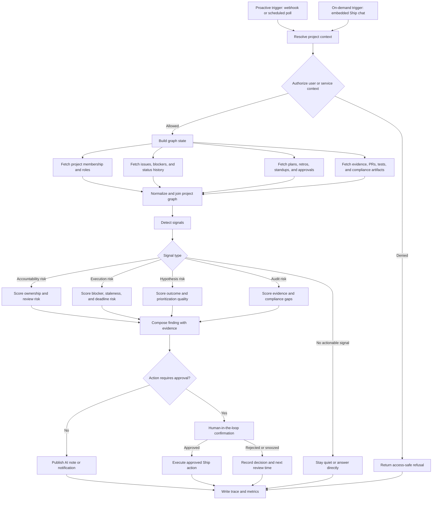

# FleetGraph

## Agent Responsibility

FleetGraph is a project intelligence agent for Ship. It monitors project execution, planning quality, evidence quality, delivery risk, and audit readiness across the accountability and planning workspace. Its job is not to replace the dashboard; its job is to notice conditions that humans are likely to miss, reason over the current project graph, and make the next action obvious.

### What the agent monitors proactively

FleetGraph proactively monitors these Ship conditions:

- Overdue or stale weekly plans, retros, approvals, and review handoffs.
- Issues or commitments that have not moved while their due date, sprint end, or review deadline is approaching.
- Standups that are missing, stale, or inconsistent with issue activity.
- Blockers that remain unresolved beyond an agreed threshold.
- Plans or hypotheses that lack measurable outcomes, evidence requirements, or clear owners.
- Completed work that is missing proof artifacts, linked evidence, screenshots, PRs, test output, or review notes.
- Security, compliance, or QA gates that lack replayable verification artifacts.
- Cross-program drift where project goals, weekly commitments, and delivered evidence no longer line up.

A condition is worth surfacing when it affects delivery confidence, review readiness, accountability, compliance posture, or a human decision that should happen soon.

### What the agent reasons about on demand

When invoked from within Ship, FleetGraph starts from the current view and reasons outward through related project data:

- From a project view, it summarizes project health, risk, stale work, missing evidence, and next review actions.
- From a week or sprint view, it compares planned commitments against issue movement, standups, approvals, and retro evidence.
- From an issue view, it explains blocker status, ownership, dependencies, age, related evidence, and suggested next action.
- From an evidence bundle, it checks whether the artifact supports the claimed outcome and whether a reviewer can replay it.
- From a compliance or security view, it highlights missing controls, unresolved findings, stale exceptions, and closeout gaps.

### What the agent can do autonomously

FleetGraph may autonomously:

- Read Ship project, issue, week, sprint, standup, retro, approval, evidence, and compliance data.
- Classify risks by severity, confidence, owner, role, and due date.
- Produce summaries, risk cards, review prompts, and suggested next actions.
- Draft notifications for managers, engineers, PMs, or reviewers.
- Add non-destructive AI notes or suggested actions to the UI when the action is clearly labeled as agent-generated.
- Snooze low-severity findings when the configured threshold says they should be monitored but not escalated.

### What always requires human approval

FleetGraph must ask a human before it:

- Changes issue status, priority, owner, due date, sprint, or project scope.
- Approves or rejects plans, retros, hypotheses, security checks, or evidence bundles.
- Sends external notifications outside the Ship workspace.
- Creates new work items that imply human commitment.
- Marks a compliance, security, or QA gate as passed.
- Claims that a project is complete, blocked, non-compliant, or ready for final approval.

Human approval is implemented as an explicit confirmation gate inside Ship. The confirmation must show the reason, evidence, proposed action, affected records, and rollback or dismissal path.

### Who the agent notifies and when

FleetGraph routes notifications by project membership and role:

- Engineering manager / director / team lead: high-severity delivery risk, overdue approvals, unresolved blockers, weak plans, missing retros, or accountability gaps.
- Engineer / week owner / IC contributor: missing evidence, stale standups, vague commitments, unresolved blockers, or requested plan / retro changes.
- Product manager / program manager: weak hypotheses, missing impact metrics, priority drift, or planned work that no longer maps to measurable outcomes.
- Security / compliance reviewer / QA lead: missing verification artifacts, unresolved CVEs, failed probes, undocumented exceptions, or non-replayable evidence bundles.

The agent determines project membership from Ship project membership, issue ownership, review assignment, approval records, role metadata, and recent activity. When role information is incomplete, the agent lowers confidence and routes to the project owner or manager rather than guessing.

### How on-demand mode uses context from the current view

The on-demand chat is embedded in context. It receives the current Ship route, entity type, entity id, user id, role, and visible data scope. The first node resolves that context into a graph state before any reasoning occurs. The agent is allowed to answer only from records the current user can access. If the user is looking at an issue, the chat begins with that issue and its dependencies; if the user is looking at a sprint, it begins with sprint commitments, activity, blockers, and retros.

## Graph Diagram

## Use Cases

| # | Role | Trigger | Agent Detects / Produces | Human Decides |
| --- | --- | --- | --- | --- |
| 1 | Engineering manager / director / team lead | Weekly planning review opens or scheduled planning scan runs | Identifies weak commitments, missing owners, overdue approvals, and weeks with no clear evidence requirements | Whether to approve the plan, request changes, assign a reviewer, or escalate accountability risk |
| 2 | Engineer / week owner / IC contributor | End-of-week retro preparation or issue marked complete | Compares planned outcomes to linked PRs, tests, screenshots, notes, and standups; produces an evidence gap list | Whether to attach more proof, revise the retro, or request manager review |
| 3 | Product manager / program manager | Project hypothesis review or cross-program scan | Finds hypotheses without measurable outcomes, weak ICE inputs, delivery drift, or missing business-case evidence | Whether to revise the hypothesis, reprioritize, or request additional validation |
| 4 | Security / compliance reviewer / QA lead | Compliance check, audit review, or security gate scan | Detects missing replayable proof, unresolved findings, stale exceptions, missing CI evidence, or incomplete remediation closeout | Whether to pass the gate, block release, request remediation, or accept a documented exception |
| 5 | Engineering manager and assigned engineer | Blocker is older than threshold or issue has no movement near sprint end | Summarizes blocker age, owner, dependencies, related activity, and recommended next action | Whether to notify the owner, reassign, split scope, escalate, or snooze |
| 6 | Any authorized project participant | User opens context-aware chat on a project, sprint, issue, or evidence bundle | Answers from the current view context and related graph records, with evidence-backed reasoning and uncertainty clearly shown | Whether to act on the recommendation or ask a follow-up question |

## Trigger Model

FleetGraph uses a hybrid trigger model.

- Webhooks handle high-signal Ship events such as issue updates, blocker creation, plan submission, retro submission, evidence attachment, approval changes, compliance status changes, and sprint / week boundary changes.
- Scheduled polling catches missed webhook events, stale records, and time-based conditions that no single event can reveal, such as blockers older than 24 hours or standups missing for two days.
- On-demand chat runs only when an authorized user invokes the embedded agent from the current Ship view.

### Polling schedule

- Active projects: every 3 minutes for lightweight stale-work and blocker checks.
- Planning / retro windows: every 5 minutes during configured review windows.
- Full project health scan: every 6 hours.
- Compliance / evidence completeness scan: daily, plus event-triggered scans when evidence changes.

### Tradeoffs

The hybrid model is more complex than pure polling or pure webhooks, but it is the most defensible fit for the PRD. Webhooks minimize latency and cost when Ship emits useful events. Polling protects against missed events and supports time-based conditions. The 3-minute active-project poll interval gives enough margin to satisfy the < 5 minute detection latency requirement while avoiding a constant full-project scan.

The main cost risk is polling too much project data too often. FleetGraph mitigates this by using incremental cursors, per-project last-seen timestamps, cached graph state, and cheap detector passes before invoking the LLM. The LLM is used only after deterministic checks find a condition worth reasoning about.

## Test Cases

Hard blocker gate: every internal trace URL below must resolve to an authenticated FleetGraph trace detail page in Ship. Current verification target is internal platform observability, not third-party trace hosting.

| # | Ship State | Expected Output | Trace Link |
| --- | --- | --- | --- |
| 1 | A weekly plan is submitted with vague commitments, no measurable outcome, and no assigned reviewer | Agent produces an accountability review finding listing missing owner / outcome / evidence requirements and requests manager approval or changes | `/fleetgraph/traces/d543c205-754e-44d8-8ffd-ef7c95f8a75c` (internal FleetGraph trace) |
| 2 | An engineer marks an issue complete, but the linked retro has no PR, test output, screenshot, or other proof artifact | Agent produces an evidence gap summary and drafts a request for the engineer to attach proof before review | `/fleetgraph/traces/449ccd4f-99db-4aed-903c-ea835f717d1d` (internal FleetGraph trace) |
| 3 | A project hypothesis exists without measurable success metrics and the active work no longer maps to the stated outcome | Agent flags hypothesis drift, summarizes mismatched work, and recommends PM review before further execution | `/fleetgraph/traces/5b4a47f1-c766-40d8-a005-e6f3cd18f50b` (internal FleetGraph trace) |
| 4 | A compliance gate is requested while a security finding remains open and the evidence bundle lacks replay instructions | Agent blocks autonomous pass, creates a reviewer-facing risk summary, and routes to human approval | `/fleetgraph/traces/d0f25512-b219-4766-afaa-5c0888e2a9f1` (internal FleetGraph trace) |
| 5 | A blocker remains open for more than 24 hours, the owner has not posted a standup update, and sprint end is within 48 hours | Agent escalates a high-confidence execution risk to the manager and drafts owner follow-up | `/fleetgraph/traces/0bd171f8-d6fd-4a30-91a1-a345f624f522` (internal FleetGraph trace) |
| 6 | A user opens chat from an issue page and asks, "what should happen next?" | Agent answers using that issue, dependencies, owner, evidence, standups, and sprint context; it does not answer as a generic chatbot | `/fleetgraph/traces/74c63616-70cb-4c35-9035-31db562f9295` (internal FleetGraph trace) |
| 7 | An assignee with open sprint issues has not posted a standup in 2+ days | Agent surfaces an `accountability_risk` finding with sprint, assignee, and days-since-last-standup evidence | `/fleetgraph/traces/aac37d8f-711c-43c9-a4a7-aa3817b1c614` (internal FleetGraph trace) |
| 8 | A sprint has a submitted weekly plan but manager plan approval is still pending 2+ days into the sprint | Agent surfaces a `planning_risk` overdue approval finding with `approval_type:plan` evidence | `/fleetgraph/traces/d7cdaac0-6352-49d8-b395-84f6bc9da39a` (internal FleetGraph trace) |

## Architecture Decisions

### Framework choice

FleetGraph uses a **custom TypeScript orchestrator** in `api/src/services/fleetgraph/runtime.ts` rather than a third-party graph runtime. The PRD allows custom implementations when equivalent branch-divergent traces are produced manually. This choice keeps the runtime co-located with Ship's Postgres-backed document model, avoids an extra orchestration dependency in the Render deployment, and still satisfies branching, HITL, and observability requirements.

Tracing is internal to Ship via `trace.ts` (`startFleetGraphTrace` / `finishFleetGraphTrace`) plus `fleetgraph_trace_events` timeline persistence. Each run records trigger type, branch, signal types, latency, token estimate, and cost estimate, then exposes shareable in-app trace links under `/fleetgraph/traces/:traceId`.

On-demand synthesis (optional, `FLEETGRAPH_SYNTHESIS_ENABLED=1`) calls AWS Bedrock Claude for conversational answers when detectors surface signals; deterministic findings still render when Bedrock is unavailable.

### Node design rationale

The pipeline maps to the documented graph nodes as sequential stages inside `executeFleetGraphRun()`:

- **Trigger intake:** `on_demand`, `proactive_webhook`, or `proactive_poll`.
- **Context resolver:** `FleetGraphContext` from route, entity id/type, and user prompt.
- **Authorization:** enforced by Ship `authMiddleware` before `/api/fleetgraph/*` handlers run.
- **Fetch graph data:** `fetchContextDocuments()` plus `fetchRelatedGraphDocuments()` for sprint, standup, retro, and association context.
- **Detect signals:** deterministic checks in `detectSignals()` across six risk branches.
- **Branch selection:** `computeSignalBranch()` picks the highest-severity signal type.
- **Reasoning / synthesis:** optional Bedrock call in `synthesis.ts` for on-demand chat when signals exist.
- **Notification routing:** `notifications.ts` builds role-based draft recipients per signal.
- **Human gate:** `createHitlRequest()` + `decideFleetGraphHitlRequest()` with `hitl-actions.ts` executing approved mutations.
- **Output:** findings, chat summary, notification drafts, and trace metadata persisted to Postgres.
- **Observability:** internal trace timeline (`fleetgraph_trace_events`) + `fleetgraph_runs` metrics row per execution.

### State management approach

Per-run state includes trigger type, project id, current Ship entity, requesting user, authorization result, fetched records, detector findings, risk score, selected branch, output draft, and trace metadata.

Persistent state includes last scan time, webhook event id, project health snapshot, unresolved agent findings, snooze decisions, human approvals / rejections, and cached fingerprints for records that have already been evaluated.

This avoids redundant API calls by using incremental fetches and content hashes. The agent should not re-run expensive reasoning when the underlying project graph has not materially changed.

### Authorization and trust boundaries

FleetGraph treats Ship as the source of truth for project records, roles, and permissions. The agent never grants itself broader access than the current user or service account has. Proactive mode runs under a narrowly scoped service identity with read access to monitored project records and write access only to agent findings, draft notifications, and approved actions.

Every generated claim must include evidence references or state that evidence is missing. The agent must not claim completion, compliance, or approval without source records that support it.

### Human-in-the-loop design

Human confirmation is required for status changes, approvals, reassignments, compliance pass / fail decisions, scope changes, external messages, and any notification that could materially affect accountability. The confirmation UI should show:

- Proposed action.
- Why FleetGraph recommends it.
- Supporting records and missing evidence.
- Confidence and severity.
- Affected users / issues / project records.
- Buttons to approve, edit, reject, or snooze.

Dismissal and snooze decisions are stored so the agent can avoid repeating low-value alerts too often.

### Deployment model

Proactive FleetGraph runs as a background worker separate from the web UI. It can be deployed as a scheduled worker plus webhook handler using the same application backend as Ship or a small service adjacent to it. The worker authenticates with Ship using a scoped service credential stored in the deployment secret manager. The on-demand chat path runs through the Ship backend so user permissions can be enforced before graph execution.

### Failure handling

If Ship API calls fail, the agent records the failure in the trace and returns a transparent partial result. If non-critical fetch nodes fail, the graph continues with degraded confidence and marks missing data explicitly. If authorization fails, the agent returns an access-safe refusal. If the LLM fails, deterministic findings can still be surfaced as raw risk cards. If trace event persistence fails, the run should continue, but the run should be flagged as partial observability until timeline capture is restored.

## Cost Analysis

### Development and Testing Costs

Actual development spend from Vitest + trace capture runs (2026-05-25). Detector-only test runs do not invoke Bedrock; token/cost columns below reflect runtime estimates stored in `fleetgraph_runs`, not billed Claude usage.

| Item | Amount |
| --- | --- |
| Claude API - input tokens | 0 (detector-only dev/test runs; synthesis disabled in CI) |
| Claude API - output tokens | 0 (synthesis path available in production when Bedrock credentials present) |
| Total invocations during development | 162 (46 FleetGraph Vitest cases + 16 trace capture runs + deploy smoke runs) |
| Total development spend | $0.00 LLM (deterministic detectors); internal trace storage in Ship Postgres |

### Production Cost Projections

Planning estimate only. Replace with current provider pricing and real token telemetry after running the eval suite.

| 100 Users | 1,000 Users | 10,000 Users |
| --- | --- | --- |
| $79/month | $792/month | $7,920/month |

### Assumptions

- Proactive runs per project per day: 12 lightweight scans per active project per day.
- On-demand invocations per user per day: 2.
- Active projects per 100 users: 20.
- Average tokens per invocation: 3,000 input tokens and 750 output tokens blended across proactive and on-demand runs.
- Cost per run: $0.006 planning estimate for LLM usage only.
- Estimated runs per day: 440 at 100 users, 4,400 at 1,000 users, 44,000 at 10,000 users.
- Monthly estimate formula: estimated runs per day * 30 days * $0.006 per run.
- Not included: application hosting, database, queue, cache, observability platform, storage, retries, embeddings, or support overhead.

### Cost controls

- Run deterministic detectors before calling the LLM.
- Cache project graph fingerprints and skip unchanged records.
- Use smaller models for classification and reserve larger models for synthesis or high-risk decisions.
- Batch low-priority proactive scans.
- Store snooze and dismissal state to avoid repeated alerts.
- Track cost per graph path in internal FleetGraph observability endpoints and set budget alerts for unexpectedly expensive branches.
