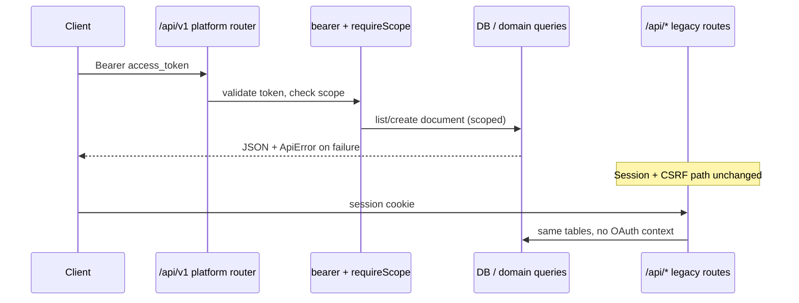
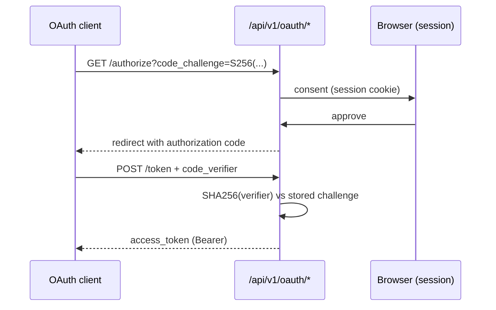

# PlugForge Platform Architecture

**Branch:** `gfa2_wk6-final` · **Last updated:** 2026-06-02  
**Source of truth:** [`deliverables/2026-W23-week-03/PRD.md`](../deliverables/2026-W23-week-03/PRD.md)

This document describes the Week 03 public platform layer as implemented on the dev branch, what remains planned per the PRD, and how the pieces connect.

---

## Current implementation snapshot

| Area | Status on `gfa2_wk6` |
| --- | --- |
| OAuth app registration + hashed secrets | **Shipped** |
| Authorization Code + PKCE | **Shipped** (Playwright + unit tests) |
| Bearer middleware + scope enforcement | **Shipped** |
| `/api/v1` documents list/get/create + cursor pagination | **Shipped** |
| `ApiError` envelope + fitness tests | **Shipped** |
| Generated OpenAPI 3.1 at `/api/v1/openapi.json` | **Shipped** (live + static copy) |
| `@ship/sdk` skeleton (`me()`, `documents.*`) | **Shipped** |
| Public/internal import boundary test | **Shipped** |
| CI MVP gates (unit, OpenAPI, PKCE E2E, perf) | **Shipped** |
| Device Authorization Grant | **Shipped** (`oauth-tokens.ts`, `/oauth/device/*`) |
| Refresh tokens + rotation | **Shipped** (family revoke on reuse) |
| Webhooks (sign, retry, DLQ, replay) | **Shipped** (`platform/webhooks/`, `events/`) |
| Rate-limit headers on public API | **Shipped** (`ratelimit/middleware.ts`) |
| Public audit trail + developer portal | **Shipped** (`audit/`, `/developer`, `/oauth/device`) |
| CLI + TTFE drill | **Shipped** (`integrations/cli`, `pnpm drill:ttfe`) |
| Agent-as-citizen rewire (Epic 7) | **Shipped** (`SHIP_AGENT_USE_PUBLIC_API`, `agent-platform.ts`) |

**Deployed proof:** [Login](https://ship-web-jyqh.onrender.com/login) · [Public OpenAPI](https://ship-web-jyqh.onrender.com/api/v1/openapi.json)

---

## Module layout

```text
api/src/platform/
├── router.ts              # Platform router: request_id, OAuth mount, v1 routes, ApiError handler
├── oauth.ts               # App registration, PKCE codes, bearer middleware, requireScope()
├── scopes.ts              # Scopes-as-data registry (registerScope / listRegisteredScopes)
├── http.ts                # PublicApiError, sendPublicError, request_id middleware
├── routes/
│   ├── oauth.ts           # POST /oauth/apps, GET/POST /oauth/authorize, POST /oauth/token
│   └── v1/
│       ├── v1.ts          # Mounts me, documents, openapi.json
│       ├── me.ts          # GET /me (authenticated profile + granted scopes)
│       ├── documents.ts   # GET/POST /documents, GET /documents/:id
│       └── openapi.ts     # GET /openapi.json (generated spec)
└── spec/
    ├── route-metadata.ts  # Canonical route list for OpenAPI + fitness tests
    └── openapi.ts         # Zod-driven OpenAPI 3.1 generator

sdk/
├── src/client.ts          # ShipClient: me(), documents.{list,getById,create}; stub issues/sprints/webhooks
├── src/types.ts           # Typed request/response shapes for public API
└── src/index.ts           # Package exports

api/src/db/migrations/
└── 047_oauth_public_platform.sql   # oauth_apps, oauth_authorization_codes, oauth_access_tokens
```

**Planned modules (PRD, not yet in tree):** `webhooks/`, `events/`, `audit/`, `ratelimit/`, `integrations/cli/`, developer portal routes under `web/`.

---

## SOLID rationale (with paths)

| Principle | Where it appears |
| --- | --- |
| **SRP** | `oauth.ts` owns token lifecycle; `documents.ts` owns HTTP mapping only; domain writes stay in existing `api/src/services/` and `pool` queries—not mixed into OAuth. |
| **OCP** | `scopes.ts` registers scopes at module load; new scopes do not require editing middleware—only `registerScope()` and route metadata. |
| **LSP** | PRD targets `IEventBus` / `IWebhookDeliverer` as swappable implementations; in-memory must-ship first, queue-backed drop-in later (**planned**). |
| **ISP** | `@ship/sdk` exposes resource-segregated clients (`documents`, future `issues`, `webhooks`) rather than one flat API class. |
| **DIP** | Public routes depend on platform abstractions (`requireBearerToken`, `requireScope`, `sendPublicError`) rather than session/CSRF internals in `app.ts`. |

---

## Composition root

Public platform wiring in `api/src/app.ts`:

```ts
// Internal API: session + CSRF + legacy /api/* routers (unchanged Part 1 surface)
app.use('/api/auth', conditionalCsrf, authRoutes);
app.use('/api/documents', conditionalCsrf, documentsRoutes);
// ... other internal routers ...

// Public platform boundary — separate middleware stack, OAuth bearer semantics
app.use('/api/v1', createPlatformRouter());
```

Inside `createPlatformRouter()` (`platform/router.ts`):

```ts
router.use(publicRequestIdMiddleware);
router.use('/oauth', oauthRouter);      // registration + authorize + token
router.use('/', publicV1Router);        // /me, /documents, /openapi.json
router.use(/* 404 + PublicApiError handler → ApiError shape */);
```

**Test wiring:** Vitest uses `createApp()` with the same composition; MVP tests seed workspace/user/OAuth app via direct DB inserts (`public-api-mvp.test.ts`).

---

## Public / internal boundary



**Enforcement:** `public-boundary.test.ts` fails CI if any file under `platform/routes/` imports legacy `api/src/routes/*` handlers.

---

## OAuth flows

### Authorization Code + PKCE (implemented)



- PKCE mismatch → `400` with `code: invalid_grant` (Playwright + `public-api-mvp.test.ts`).
- Access tokens: opaque, SHA-256 hashed at rest, 1 h TTL (`oauth.ts`).
- Expired token → `401` with `code: token_expired` (distinct from generic `unauthorized`).

### Device Authorization Grant (planned)

PRD target: `/oauth/device/code`, user verification, poll `/oauth/token` with `slow_down` support. Not yet implemented on `gfa2_wk6`.

### Refresh tokens (planned)

PRD target: one-time-use rotation + family invalidation on reuse. Schema not migrated yet.

---

## Webhook pipeline (planned)

Target architecture per PRD—**not implemented** on current branch:

```text
Domain write → IEventBus → subscription matcher → HMAC signer
  → IWebhookDeliverer → retry scheduler (1s,4s,16s,1m,5m,30m)
  → delivery log → DLQ → POST /webhooks/deliveries/:id/replay
```

Signature target: `Ship-Signature: t=<unix>,v1=<hex-hmac-sha256>`; SDK `verifyWebhook()` helper; idempotency key on replay.

---

## SDK surface

| Surface | Status | Notes |
| --- | --- | --- |
| `ShipClient({ token, baseUrl? })` | Shipped | |
| `client.me()` | Shipped | Typed `ShipMeResponse` |
| `client.documents.list/getById/create` | Shipped | Cursor via `list({ cursor })` |
| `client.documents.iterate()` | Planned | Async-iterator pagination |
| `client.issues / sprints / webhooks` | Stub | Empty objects in `client.ts` |
| `ShipClient.deviceLogin()` | Planned | Device flow helper |
| `verifyWebhook()` | Planned | Stripe-style HMAC verifier |
| Typed error union (`kind: auth \| rate_limit \| …`) | Planned | Currently throws `Error` with message |

---

## Agent-as-citizen (planned)

**Before (Part 2 today):** FleetGraph agent calls internal services/routes directly.

**After (Epic 7 target):** First-party OAuth app → `@ship/sdk` → `/api/v1/*` → same domain services, with audit rows showing `client_id` + scopes.

Migration will run behind a feature flag so Part 2 tests pass with flag on or off.

---

## Failure modes

| Failure | Current behavior |
| --- | --- |
| Missing/invalid bearer token | `401` `unauthorized`, `ApiError` + `request_id` |
| Expired access token | `401` `token_expired` |
| Insufficient scope | `403` `forbidden`, `details.missing_scope` names required scope |
| Wrong PKCE verifier | `400` `invalid_grant` |
| Unknown `/api/v1` path | `404` `not_found` |
| Unhandled platform error | `500` `server_error` (no stack in body) |
| OpenAPI generator throws at boot | Route handlers lazy-generate spec; generator covered by `openapi-schema.test.ts` |
| Token store corrupted (client) | SDK consumer responsibility; server has no refresh path yet |
| Webhook deliverer crash | **N/A** — not implemented; PRD targets at-least-once + subscriber dedupe |

---

## Verification

| Check | Location |
| --- | --- |
| MVP hard gates | `api/src/platform/public-api-mvp.test.ts` |
| Route/spec/error fitness | `api/src/platform/public-api-fitness.test.ts` |
| OpenAPI 3.1 schema validation | `api/src/platform/openapi-schema.test.ts` |
| Public/internal imports | `api/src/platform/public-boundary.test.ts` |
| PKCE E2E | `e2e/oauth-pkce.spec.ts` |
| SDK `me()` | `sdk/src/client.test.ts` |
| Perf +10% budget | `scripts/mvp/perf-regression-check.mjs` |
| CI orchestration | `.github/workflows/mvp-gates.yml` |

Regenerate static spec: `pnpm --filter @ship/api openapi:generate:public` → `docs/openapi.json`.

---

## Related documents

- Defense talk track: [`deliverables/2026-W23-week-03/ARCHITECTURE_DEFENSE.md`](../deliverables/2026-W23-week-03/ARCHITECTURE_DEFENSE.md)
- Pre-search decisions: [`deliverables/2026-W23-week-03/PRESEARCH.md`](../deliverables/2026-W23-week-03/PRESEARCH.md)
- Evidence checklist: [`deliverables/2026-W23-week-03/DELIVERABLES.md`](../deliverables/2026-W23-week-03/DELIVERABLES.md)
