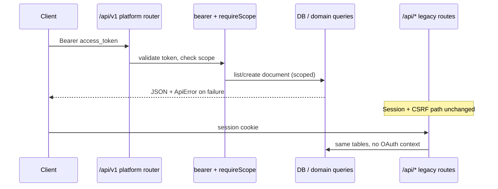
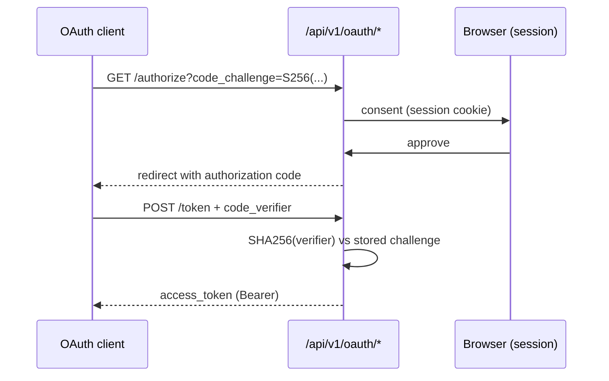

# PlugForge Platform Architecture

**Branch:** `gfa2_wk6-final` · **Last updated:** 2026-06-03  
**Source of truth:** [`deliverables/2026-W23-week-03/PRD.md`](../deliverables/2026-W23-week-03/PRD.md)

This document describes the Week 03 public platform layer as implemented on the dev branch, what remains planned per the PRD, and how the pieces connect.

---

## Current implementation snapshot

| Area | Status on `gfa2_wk6-final` |
| --- | --- |
| OAuth app registration + hashed secrets | **Shipped** |
| Authorization Code + PKCE | **Shipped** (Playwright + unit tests) |
| Bearer middleware + scope enforcement | **Shipped** |
| `/api/v1` documents list/get/create + cursor pagination | **Shipped** |
| `ApiError` envelope + fitness tests | **Shipped** |
| Generated OpenAPI 3.1 at `/api/v1/openapi.json` | **Shipped** (live + static copy) |
| `@ship/sdk` skeleton (`me()`, `documents.*`) | **Shipped** |
| Public/internal import boundary test | **Shipped** |
| CI MVP gates (unit, OpenAPI, measured perf, PKCE E2E) | **Shipped** |
| Device Authorization Grant | **Shipped** (`oauth-tokens.ts`, `/oauth/device/*`) |
| Refresh tokens + rotation | **Shipped** (family revoke on reuse) |
| Webhooks (sign, retry, DLQ, replay) | **Shipped** (`platform/webhooks/`, `events/`) |
| Rate-limit headers on public API | **Shipped** (`ratelimit/middleware.ts`) |
| Public audit trail + developer portal | **Shipped** (`audit/`, `/developer`, `/oauth/device`) |
| CLI + TTFE drill | **Shipped** (`integrations/cli`, `pnpm drill:ttfe`) |
| Issues / sprints public routes | **Shipped** (`routes/v1/issues.ts`, `routes/v1/sprints.ts`) |
| `@ship/sdk` issues + sprints clients | **Shipped** (`sdk/src/client.ts`) |
| Agent-as-citizen rewire (Epic 7) | **Shipped** (`SHIP_AGENT_USE_PUBLIC_API`, SDK document fetch path) |

**Deployed proof:** [Login](https://ship-web-jyqh.onrender.com/login) · [Public OpenAPI](https://ship-web-jyqh.onrender.com/api/v1/openapi.json) — redeploy `gfa2_wk6-final` after merge; run `node scripts/platform/verify-deploy.mjs`.

---

## Module layout

```text
api/src/platform/
├── router.ts              # Platform router: request_id, OAuth mount, v1 routes, ApiError handler
├── oauth.ts               # App registration, PKCE codes, bearer middleware, secret rotation
├── oauth-tokens.ts        # Device grant, refresh rotation, token issuance
├── scopes.ts              # Scopes-as-data registry (registerScope / listRegisteredScopes)
├── http.ts                # PublicApiError, sendPublicError, request_id middleware
├── agent-platform.ts      # First-party OAuth app + SDK fetch path for FleetGraph
├── events/
│   ├── bus.ts             # IEventBus in-process implementation
│   ├── registry.ts        # Event types + Zod validation
│   └── publish.ts         # Domain event publishers (document, issue, sprint)
├── webhooks/
│   ├── deliverer.ts       # Retry, DLQ, replay, event-bus wiring (all event types)
│   └── signer.ts          # HMAC-SHA256 Ship-Signature headers
├── ratelimit/middleware.ts
├── audit/middleware.ts
├── routes/
│   ├── oauth.ts           # Apps, authorize, token, device, portal-token, rotate-secret
│   └── v1/
│       ├── documents.ts   # GET/POST /documents
│       ├── issues.ts      # GET/POST /issues
│       ├── sprints.ts     # GET/POST /sprints, POST /sprints/:id/start
│       ├── webhooks.ts    # Subscriptions, deliveries, replay
│       ├── audit.ts       # Public API audit log
│       └── me.ts          # GET /me
└── spec/
    ├── route-metadata.ts  # Canonical route list for OpenAPI + fitness tests
    └── openapi.ts         # Zod-driven OpenAPI 3.1 generator

sdk/
├── src/client.ts          # ShipClient: documents, issues, sprints, webhooks, auth helpers
├── src/auth.ts            # deviceLogin, authorizationCodeFlow, ITokenStore (memory, file, localStorage)
├── src/webhooks.ts        # verifyWebhook
└── src/index.ts

integrations/cli/          # ship login, docs *, webhooks tail (poll + verifyWebhook)

web/src/pages/
├── DeveloperPortalPage.tsx  # Apps, rotate secret, portal token, subscriptions, deliveries, audit
└── OAuthDeviceVerifyPage.tsx
```

---

## SOLID rationale (with paths)

| Principle | Where it appears |
| --- | --- |
| **SRP** | `oauth.ts` owns token lifecycle; `documents.ts` owns HTTP mapping only; domain writes stay in existing `api/src/services/` and `pool` queries—not mixed into OAuth. |
| **OCP** | `scopes.ts` registers scopes at module load; new scopes do not require editing middleware—only `registerScope()` and route metadata. |
| **LSP** | `IEventBus` / `WebhookDeliverer` in `events/bus.ts` and `webhooks/deliverer.ts`; in-memory must-ship, queue-backed drop-in later. |
| **ISP** | `@ship/sdk` exposes resource-segregated clients (`documents`, `issues`, `sprints`, `webhooks`) rather than one flat API class. |
| **DIP** | Public routes depend on platform abstractions (`requireBearerToken`, `requireScope`, `sendPublicError`) rather than session/CSRF internals in `app.ts`. |

---

## Composition root

Public platform wiring in `api/src/app.ts`:

```ts
// Internal API: session + CSRF + legacy /api/* routers (unchanged Part 1 surface)
app.use('/api/auth', conditionalCsrf, authRoutes);
app.use('/api/documents', conditionalCsrf, documentsRoutes);
// ... other internal routers ...

// Public platform boundary — separate middleware stack, OAuth bearer semantics
app.use('/api/v1', createPlatformRouter());
```

Inside `createPlatformRouter()` (`platform/router.ts`):

```ts
router.use(publicRequestIdMiddleware);
router.use('/oauth', oauthRouter);      // registration + authorize + token + device
router.use('/', publicV1Router);        // /me, /documents, /issues, /sprints, /webhooks, /audit, /openapi.json
router.use(/* 404 + PublicApiError handler ->’ ApiError shape */);
```

**Test wiring:** Vitest uses `createApp()` with the same composition; MVP tests seed workspace/user/OAuth app via direct DB inserts (`public-api-mvp.test.ts`).

---

## Public / internal boundary



**Enforcement:** `public-boundary.test.ts` fails CI if any file under `platform/routes/` imports legacy `api/src/routes/*` handlers.

---

## OAuth flows

### Authorization Code + PKCE (implemented)



- PKCE mismatch ->’ `400` with `code: invalid_grant` (Playwright + `public-api-mvp.test.ts`).
- Access tokens: opaque, SHA-256 hashed at rest, 1 h TTL (`oauth.ts`).
- Expired token ->’ `401` with `code: token_expired` (distinct from generic `unauthorized`).

### Device Authorization Grant (planned)

PRD target: `/oauth/device/code`, user verification, poll `/oauth/token` with `slow_down` support. Not yet implemented on `gfa2_wk6`.

### Refresh tokens (planned)

PRD target: one-time-use rotation + family invalidation on reuse. Schema not migrated yet.

---

## Webhook pipeline (shipped)

```text
Domain write ->’ publishDocumentCreated() ->’ IEventBus ->’ subscription matcher
  ->’ HMAC signer ->’ WebhookDeliverer ->’ retry scheduler (1s,4s,16s,1m,5m,30m)
  ->’ delivery log ->’ DLQ ->’ POST /webhooks/deliveries/:id/replay
```

Signature: `Ship-Signature: t=<unix>,v1=<hex-hmac-sha256>`; SDK `verifyWebhook()` in `sdk/src/webhooks.ts`; `Idempotency-Key` preserved on replay.

Implementation: `api/src/platform/webhooks/deliverer.ts`, `events/bus.ts`, `events/publish.ts`.

---

## SDK surface

| Surface | Status | Notes |
| --- | --- | --- |
| `ShipClient({ token, baseUrl? })` | Shipped | |
| `client.me()` | Shipped | Typed `ShipMeResponse` |
| `client.documents.list/getById/create/iterate()` | Shipped | Async-iterator pagination |
| `client.webhooks.create/list/listDeliveries/replay()` | Shipped | |
| `client.issues / sprints` | Deferred | Scopes registered; routes not shipped |
| `ShipClient.deviceLogin()` | Shipped | RFC 8628 + `ITokenStore` |
| `ShipClient.authorizationCodeFlow()` | Shipped | PKCE + token exchange |
| `verifyWebhook()` | Shipped | Stripe-style HMAC verifier |
| Typed error union (`ShipSdkError`, `kind`) | Shipped | `sdk/src/errors.ts` |

Parity: `api/src/platform/sdk-openapi-parity.test.ts`.

---

## Agent-as-citizen (shipped)

**Before (Part 2):** FleetGraph agent calls internal services/routes directly.

**After (Epic 7):** `SHIP_AGENT_USE_PUBLIC_API=true` ->’ first-party OAuth app ->’ `@ship/sdk` ->’ `/api/v1/me` probe; audit middleware logs `client_id`.

Proof: `api/src/platform/agent-platform.test.ts`.

---

## Failure modes

| Failure | Current behavior |
| --- | --- |
| Missing/invalid bearer token | `401` `unauthorized`, `ApiError` + `request_id` |
| Expired access token | `401` `token_expired` |
| Insufficient scope | `403` `forbidden`, `details.missing_scope` names required scope |
| Wrong PKCE verifier | `400` `invalid_grant` |
| Unknown `/api/v1` path | `404` `not_found` |
| Unhandled platform error | `500` `server_error` (no stack in body) |
| OpenAPI generator throws at boot | Route handlers lazy-generate spec; generator covered by `openapi-schema.test.ts` |
| Token store corrupted (client) | SDK consumer responsibility; use `ITokenStore` |
| Webhook deliverer crash | At-least-once delivery; subscribers dedupe via `Idempotency-Key`; pending rows retried on restart |

---

## Verification

| Check | Location |
| --- | --- |
| MVP hard gates | `api/src/platform/public-api-mvp.test.ts` |
| Route/spec/error fitness | `api/src/platform/public-api-fitness.test.ts` |
| OpenAPI 3.1 schema validation | `api/src/platform/openapi-schema.test.ts` |
| Public/internal imports | `api/src/platform/public-boundary.test.ts` |
| PKCE E2E | `e2e/oauth-pkce.spec.ts` |
| SDK `me()` | `sdk/src/client.test.ts` |
| SDK/OpenAPI parity | `api/src/platform/sdk-openapi-parity.test.ts` |
| Webhook retry/DLQ/replay | `api/src/platform/webhooks-deliverer.test.ts` |
| TTFE drill | `integrations/cli/tests/ttfe.drill.ts` + `scripts/platform/run-ttfe-ci.mjs` |
| Perf +10% budget | `scripts/mvp/run-perf-probe.mjs` · `scripts/mvp/capture-perf-metrics.mjs` · `scripts/mvp/perf-regression-check.mjs` |
| CI orchestration | `.github/workflows/mvp-gates.yml`, `.github/workflows/platform-gates.yml` |

### Performance regression (PRD § Performance Targets)

MVP gate #9 enforces <= +10% vs Part 1 baseline ([`perf-baseline.json`](../deliverables/2026-W23-week-03/perf-baseline.json)) on P95 latency, bundle size, and **measured** per-route query counts.

| Metric | How captured | Baseline | Current (2026-06-03) |
| --- | --- | --- | --- |
| `latency_p95_ms` | Max of Week 01 C3 route envelope + live `/health` P95 when probed | 2500 | 471 |
| `bundleSizeKb` | Gzip sum of `web/dist/assets/*.js` | 1800 | 679 |
| `queryCountPerRoute` | Live probe: `QUERY_COUNT_METRICS=1` ->’ reset counter ->’ authenticated `GET /api/documents` ->’ read `/api/_metrics/query-count` | 120 | 4 (measured) |

**Canonical local/CI flow:**

```bash
pnpm build:api && pnpm build:web
pnpm --filter @ship/api db:migrate && pnpm --filter @ship/api db:seed
node scripts/mvp/run-perf-probe.mjs    # sets PERF_PROBE_URL + PERF_PROBE_COOKIE
node scripts/mvp/perf-regression-check.mjs
```

CI ([`mvp-gates.yml`](../.github/workflows/mvp-gates.yml)) runs the perf probe **after** `build:web` and **before** Playwright install so measured query counts are captured even if E2E steps time out. `perf-regression-check.mjs` fails if `notes.queryCount` contains `estimate`.

Evidence: [`deliverables/2026-W23-week-03/evidence/perf-regression-2026-06-03.log`](../deliverables/2026-W23-week-03/evidence/perf-regression-2026-06-03.log) · artifact [`artifacts/perf/current-metrics.json`](../artifacts/perf/current-metrics.json).

Regenerate static spec: `pnpm --filter @ship/api openapi:generate:public` ->’ `docs/openapi.json`.

---

## Related documents

- Defense talk track: [`deliverables/2026-W23-week-03/ARCHITECTURE_DEFENSE.md`](../deliverables/2026-W23-week-03/ARCHITECTURE_DEFENSE.md)
- Pre-search decisions: [`deliverables/2026-W23-week-03/PRESEARCH.md`](../deliverables/2026-W23-week-03/PRESEARCH.md)
- Evidence checklist: [`deliverables/2026-W23-week-03/DELIVERABLES.md`](../deliverables/2026-W23-week-03/DELIVERABLES.md)
